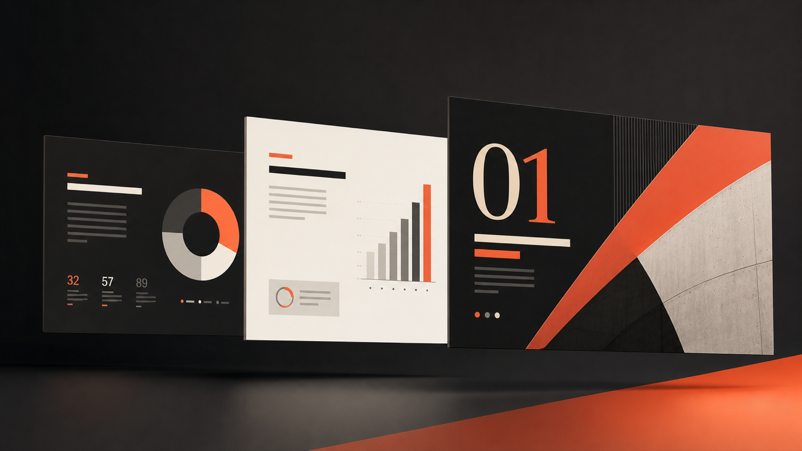
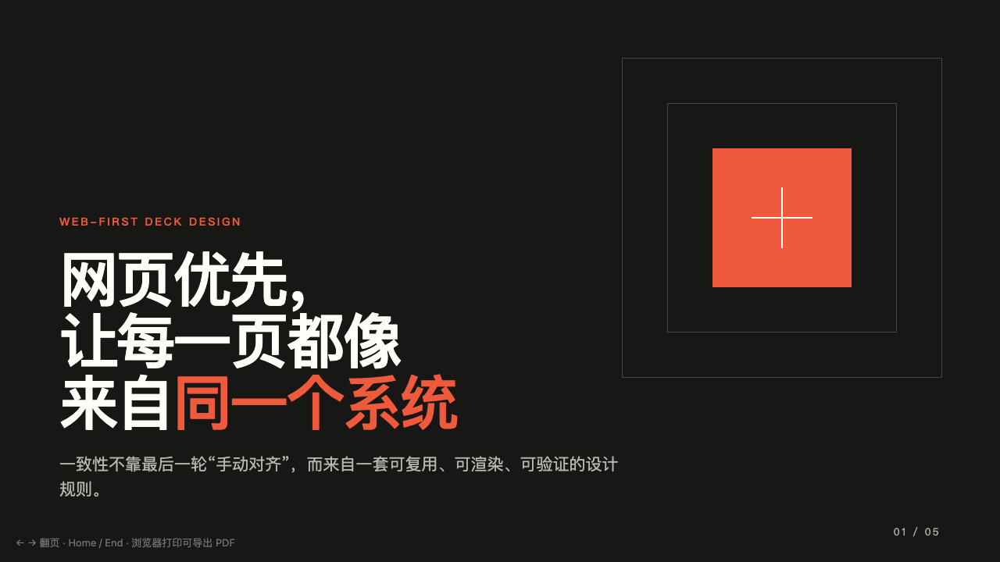
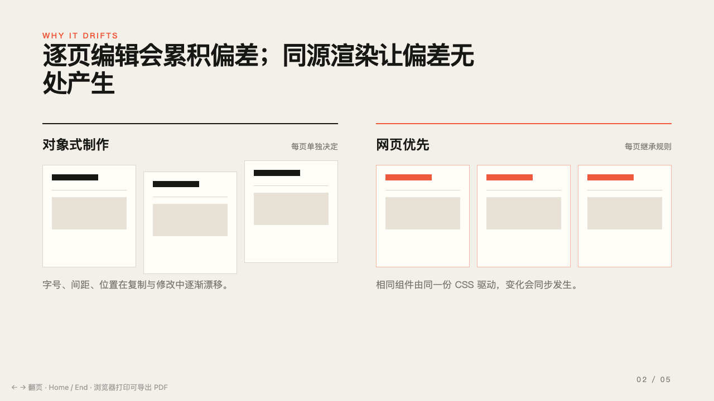
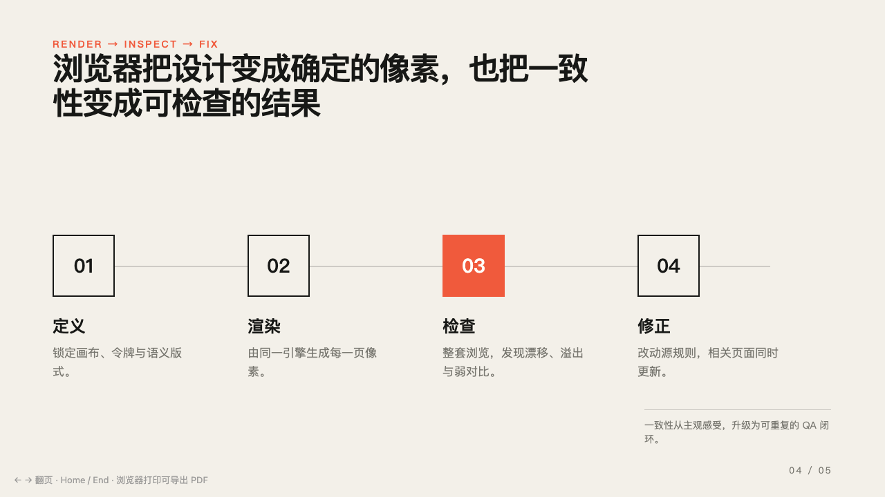

<div align="center">

# Design PPT

**让 Agent 做出“经过设计”的演示文稿，而不是把内容装进一堆方框。**

[English](README.md) · [简体中文](README.zh-CN.md) · [日本語](README.ja.md)

</div>



Design PPT 是一个可移植的 Agent Skill，用来把原始资料转化为专业、统一、可交付的演示文稿。它把故事结构、视觉方向、语义版式、生产规范和渲染检查封装在标准 `SKILL.md` 中。

它**不依赖** Open Design、MCP、daemon 或单独的设计软件。

## 它解决什么问题

- **先讲故事，再做页面**：排版前先确定受众、核心结论、证据和期望行动。
- **结论式标题**：每页标题表达观点，而不是只写“市场分析”“项目计划”等主题词。
- **统一设计系统**：统一管理字体、颜色、间距、图片、图表和形状语言。
- **按目的选择版式**：根据表达任务使用宣言、证据、对比、流程、系统、案例、引用或表格版式。
- **抑制常见 AI 味**：避免满屏卡片、小字、无意义渐变、胶囊标签、低对比度和装饰性图标。
- **基于渲染结果检查**：检查真实画面中的溢出、裁切、层级、节奏、对比度和一致性。
- **明确交付模式**：默认优先可编辑 PPTX；只有在视觉保真度优先时才使用图片型 PPTX；HTML 仅作为明确说明的降级方案。

## 实际输出示例

下面三页来自 Skill 的独立前向测试，只使用仓库自带的 HTML 模板，没有外部字体、图片或演示服务。

| 封面 | 对比 | 流程 |
|:---:|:---:|:---:|
|  |  |  |

## 安装方法

### 让 Agent 自动安装（推荐）

在 Codex 中输入：

```text
使用 $skill-installer 安装下面仓库中的 Skill，并验证安装结果：
https://github.com/zuomian726/design-ppt
```

对于其他兼容 Agent Skills 的 Agent，可以输入：

```text
把 https://github.com/zuomian726/design-ppt 安装成 Agent Skill。
将仓库根目录放入当前 Agent 配置的 skills 目录，并验证 SKILL.md。
```

### 手动安装到 Codex

```bash
git clone https://github.com/zuomian726/design-ppt.git \
  "${CODEX_HOME:-$HOME/.codex}/skills/design-ppt"
```

安装后重启 Codex，或者新建一个任务，让 Skill 列表重新加载。

### 更新

```bash
git -C "${CODEX_HOME:-$HOME/.codex}/skills/design-ppt" pull --ff-only
```

## 使用方法

需要严格应用设计规则时，显式调用 `$design-ppt`：

```text
使用 $design-ppt，把附件中的战略文档制作成 12 页可编辑的管理层 PPTX。
受众：公司管理层。视觉方向：克制、编辑式、高对比、数据驱动。
```

```text
使用 $design-ppt 重新设计这份旧 PPT，不要修改事实和数据。
保持内容可编辑，并同时交付 PPTX 和 PDF 预览。
```

```text
使用 $design-ppt 制作一份中英双语投资人 Deck。
使用结论式标题、真实图表和有变化的页面节奏。
```

创建或修改 PPT/PPTX、路演 Deck、管理层汇报、发布会演示、Keynote 风格演讲稿或 HTML Deck 时，Agent 也可以根据 Skill 描述自动触发。

## 工作原理

```text
原始资料
   ↓
受众 + 核心结论 + 证据
   ↓
每页一个结论的页面地图
   ↓
字体 + 配色 + 网格 + 图片系统
   ↓
原生 PPTX 或固定画布 HTML
   ↓
渲染 → 检查 → 修正 → 交付
```

Agent 会始终读取核心视觉规则；新建或重构 Deck 时再读取故事与版式参考；开始制作和导出前读取生产与 QA 规范。通过渐进加载控制上下文长度。

## 输出模式

| 模式 | 适用场景 | 可编辑性 | 视觉保真度 |
|---|---|---:|---:|
| 原生 PPTX | 业务评审、协作修改、周期性报告 | 高 | 高，但受查看器影响 |
| 图片型 PPTX | 发布会、视觉提案、最终展示 | 低 | 很高 |
| 自包含 HTML | 浏览器演示或没有 PPTX 工具时 | 源码可编辑 | 浏览器中很高 |

Skill 不会把 HTML、PDF 或幻灯片图片冒充成可编辑 PPTX。

## 运行要求与兼容性

- 支持 Agent Skills / `SKILL.md` 目录的 Agent。
- 制作可编辑 PPTX 时，需要 Agent 自带演示文稿工具或相应库。
- 做视觉 QA 时，建议拥有浏览器或演示文稿渲染能力。
- 不强制要求 API Key、MCP、daemon 或桌面设计软件。

本 Skill 已在 Codex 中完成结构验证和前向测试。其他兼容 Agent 也能读取相同文件，但最终能否生成 PPTX，取决于该 Agent 自身的演示文稿与渲染能力。

## 仓库结构

```text
design-ppt/
├── SKILL.md                         # 触发条件和执行流程
├── agents/openai.yaml              # Codex 界面元数据
├── references/
│   ├── design-rules.md             # 视觉质量底线
│   ├── story-and-layouts.md         # 故事结构与语义版式
│   └── production-and-qa.md        # 制作、渲染与导出检查
└── assets/
    ├── html-deck/index.html        # 无依赖 HTML 降级模板
    └── readme/                     # README 图片和示例
```

## 核心设计原则

1. 每页一个结论、一个视觉焦点。
2. 优先使用构图和留白，而不是容器和装饰。
3. 优先展示真实证据，而不是库存图标和填充元素。
4. 整套 Deck 保持一致，页面序列保持节奏变化。
5. 交付前必须检查真实渲染画面。
6. 明确说明可编辑性和导出方式的取舍。

## 开源协议

[MIT](LICENSE)
